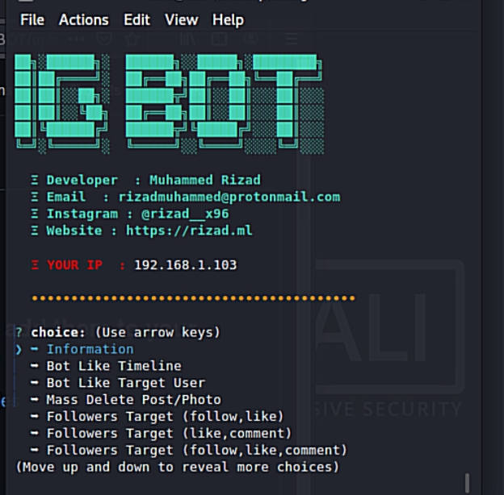

# IG-BOT

  

it is an Node js Oriented tool to Automating Instagram Actions.
Based on Instagram API

### What Is Instagram Bot ?

Instagram bots are a type of software that automates your interactions across Instagram. 
Depending on the type of bot you use, they can like posts, make comments, answer polls,
send direct messages, and follow new profiles all on your behalf. Bots take the drudgery
out of maintaining your own social accounts.

## Demo
 

## Requirements
 `sudo apt install nodejs-lts` (linux Based)
         Or
 `pkg install nodejs-lts` (other)
## Installation

#### Step 1
`git clone https://github.com/riz4d/IG-BOT`
#### Step 2
`cd IG-BOT`

#### Step 3
`npm i`

#### Step 4
`node index.js`

## Warning
Use this script in your own risk, i'm not responsible if any issues on your account

## Developer Info

